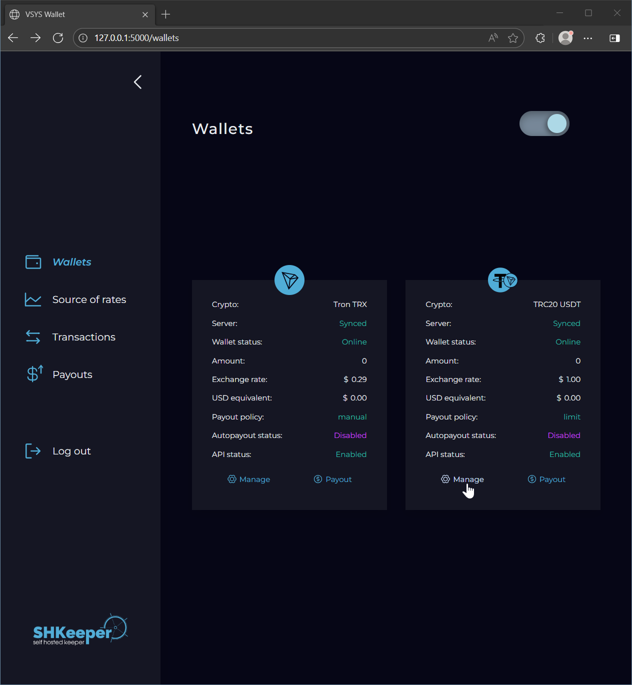
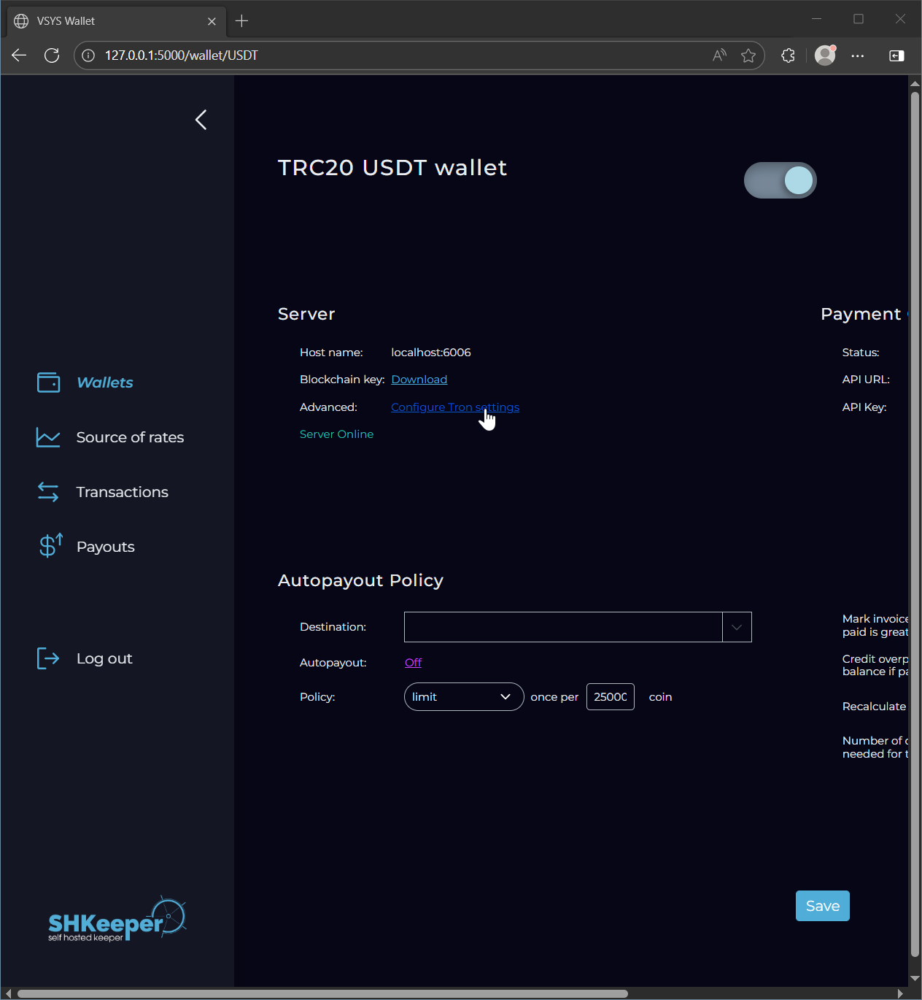
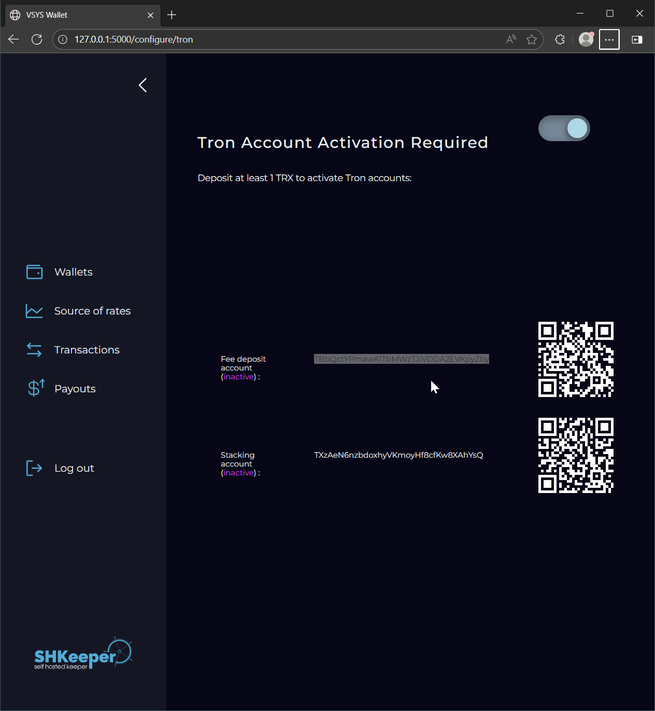
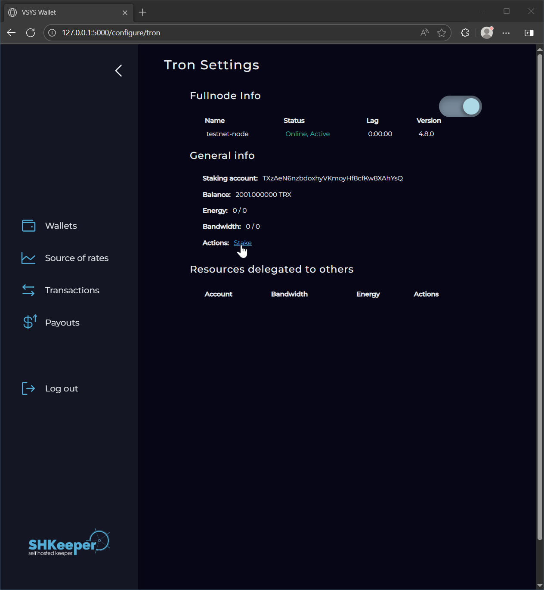
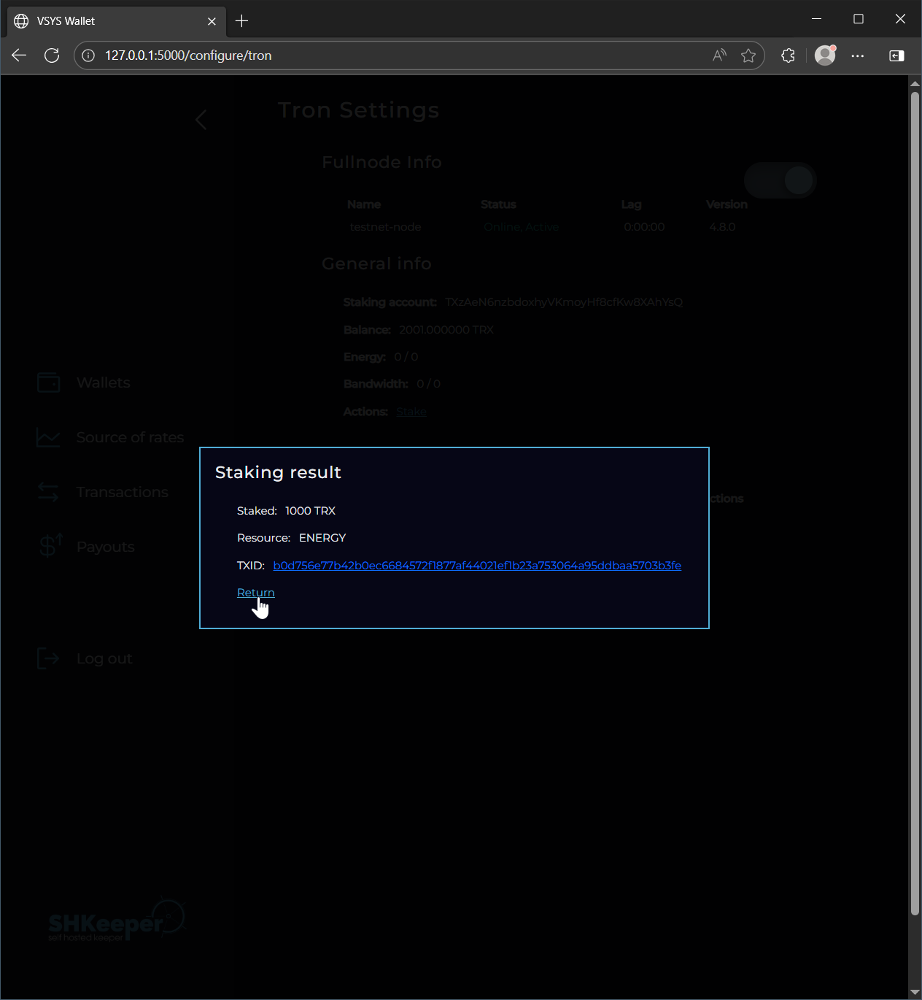
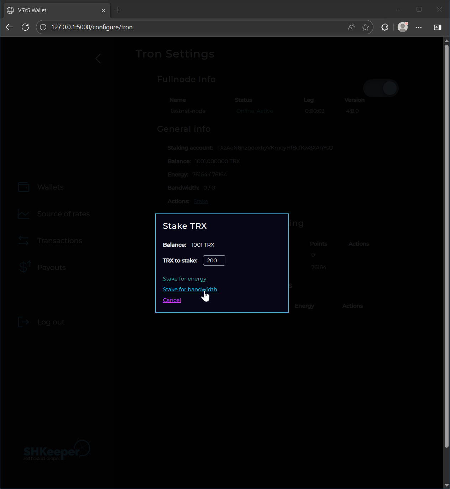

# TRON staking (energy, bandwidth, SR voting)

TRON “staking” ties up TRX to obtain two on-chain resources and (optionally) to vote for Super Representatives (SRs):

- Bandwidth: pays for basic transactions (e.g., TRX transfers). If you don’t have enough bandwidth, the network burns a small amount of TRX instead.
- Energy: pays for smart-contract execution (e.g., TRC‑20 token transfers). If you don’t have enough energy, TRX is burned according to execution cost.

With staked TRX you can also vote for SRs and obtain TRX as reward.

## What this feature automates

- Automatic Energy delegation for TRC‑20 payouts
	- When enabled, the feature estimates required Energy for outgoing operations and delegates Energy from your account (or from a dedicated “energy” account) to avoid TRX burn.
	- Optional fallbacks can allow TRX burn if there isn’t enough Energy.

- Super Representative (SR) voting
	- If enabled, the feature casts votes to the SR addresses you provide. You control the split via absolute vote counts per SR.
	- Ensure you have sufficient staked TRX to cover the total votes you configure.


## Relevant settings

Energy delegation:

- `ENERGY_DELEGATION_MODE` (bool): master switch for energy delegation.
- `ENERGY_DELEGATION_MODE_ALLOW_BURN_TRX_FOR_BANDWITH` (bool): allow TRX burn for bandwidth if needed.
- `ENERGY_DELEGATION_MODE_ALLOW_BURN_TRX_ON_PAYOUT` (bool): allow TRX burn on payouts if Energy is insufficient.
- `ENERGY_DELEGATION_MODE_ALLOW_ADDITIONAL_ENERGY_DELEGATION` (bool): permit temporarily delegating extra Energy when estimated usage is higher than usual.
- `ENERGY_DELEGATION_MODE_ENERGY_DELEGATION_FACTOR` (decimal): multiplier for delegated Energy vs. estimated need (e.g., `1.0` means match estimate, `1.2` adds 20% buffer).
- `ENERGY_DELEGATION_MODE_SEPARATE_BALANCE_AND_ENERGY_ACCOUNTS` (bool): if `true`, use a dedicated account only for Energy operations.

SR voting:

- `SR_VOTING` (bool): enable SR voting.
- `SR_VOTES` (JSON list): target distribution of votes; each item has `{ "vote_address": <SR Tron address>, "vote_count": <positive integer> }`.
- `SR_VOTING_ALLOW_BURN_TRX` (bool): allow a small TRX burn if voting transactions need bandwidth/energy beyond what is delegated.


## Helm configuration examples using values.yaml

### 1) Energy delegation for TRC‑20 payouts (fee-deposit account is also a staking account)

Use your main wallet both for balance and Energy. The feature will try to delegate enough Energy so TRC‑20 payouts don’t burn TRX; it may still burn TRX for bandwidth if allowed.

```yaml
tron_shkeeper:
  extraEnv:
    ENERGY_DELEGATION_MODE: 1
```

### 2) Energy delegation with a dedicated Energy account

Keep funds and Energy delegation separate. Point the feature to an Energy-only account for delegations.

```yaml
tron_shkeeper:
  extraEnv:
    ENERGY_DELEGATION_MODE: 1
    ENERGY_DELEGATION_MODE_SEPARATE_BALANCE_AND_ENERGY_ACCOUNTS: 1
```

### 3) Minimal SR voting

This enables voting for a single SR addresse. Replace the example `T...` addresses and vote counts to match your staking.

```yaml
tron_shkeeper:
  extraEnv:
    ENERGY_DELEGATION_MODE: 1
    SR_VOTING: 1
    SR_VOTES: |
        [
          {
            "vote_address": "TAAAAAAAAAAAAAAAAAAAAAAAAAAAAAAA",
            "vote_count": 157800
          }
        ]
```

Guidance:

- The sum of `vote_count` should not exceed the total votes available from your staked TRX.
- You can adjust the voting any time by updating `SR_VOTES` and running helm upgrade command.

## Tips and edge cases

- If you see validation errors like “not a Tron address”, double-check your `T...` addresses are valid base58check strings.
- Voting transactions also require resources; if they fail, temporarily enable `SR_VOTING_ALLOW_BURN_TRX=true` or increase available bandwidth/energy.

# Staking TRX from Shkeeper
1. Click "Manage" on any Tron asset.

  

2. Click "Configure Tron Settings".

  

3. Fund the Balance and (if used) the Staking/Energy accounts, then reload the page.
  If you chose not to separate accounts, only one account will appear.

  

4. After funding, click "Stake".

  

5. Enter the amount of TRX to stake for Energy. Use the Resource Calculator to estimate required TRX: https://tronscan.org/#/tools/tronstation

  

6. Confirm the staking transaction and return to the overview.

  

7. Repeat the process to stake TRX for Bandwidth.

  

8. Confirm the Bandwidth staking transaction and return to the overview.

  

9. Once confirmed on-chain, the overview should show acquired Energy and Bandwidth resource points.

  
